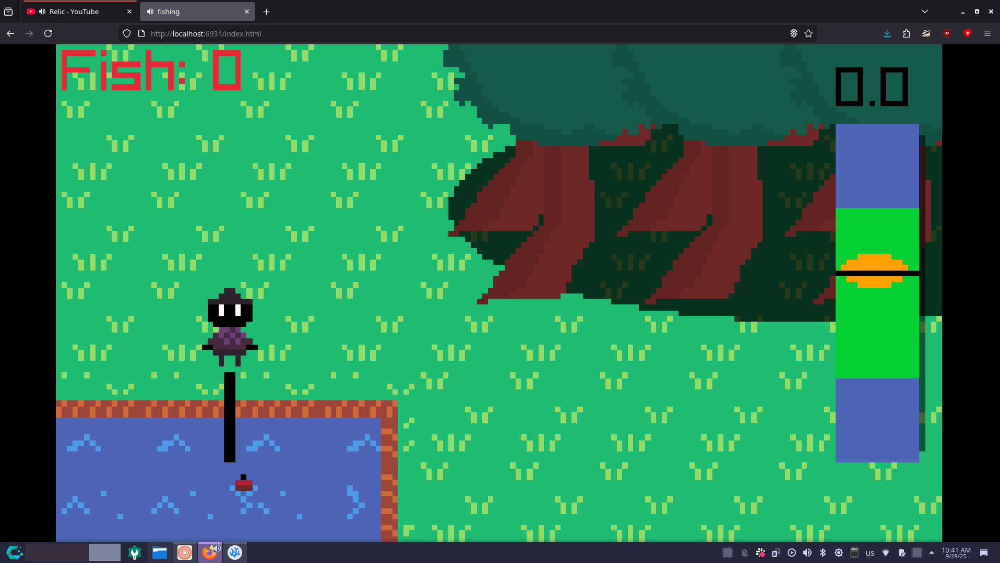

# THE PROJECT TEMPLATE I USED (all of their C code was replaced my crappy "C++")
(I modified the build system a little to use C++ and with my environment)
https://github.com/Paperdomo101/WebDemo

 </img>
# Other Credits
yeah not really any that I can think of
<br> My friend Ryan for teaching me how to code on January 1st 2023<br>
<!--Ignore the makefile using /bin/chromium-->
[](https://sheepy.moe)
[](https://www.firefox.com/) 
[](https://3ds.hacks.guide)
[]()
[](https://www.protondb.com/)
[](https://github.com/ReallyNotPikachu/Daydream-Thingy/)
[](https://deltarune.com)

## Tools used
<ul>
<li>VSCodium - IDE </li>
<li>Emscripten - C++ Compiler </li>
<li>Raylib - Game Library</li>
<li>Pixelorama - Art</li>
<li>LMMS - Music and SFX</li>
<li>Tenacity - SFX</li>
<li>CachyOS - Operating System</li>
</ul>


## Basic plot summary
Fish are desirable, gather them from the nearby lake.
Bring them into the red circle in the forest for me please.

## Controls
**WASD** to move 
**K** to confirm/fish/skip some cutscenes
Hold **J** to sprint

## Notes for reviewers
pls give me 2nd place I want blahaj

## Minimum specs
Tested working on Toshiba Satellite L775D
<br> I was overclocked to 1.9ghz and got around 300-500 FPS using the native build
<ul>
<li>AMD A6 3400M</li>
<li>Radeon HD 6520g</li>
<li>8GB DDR3</li>
</ul>
<br> web build idrk

## Notes for myself
Pls win, and yes I did star my own repo.<br>
**please stop editing the readme and work on the actual game**

## building!!11

compile raylib for emscripten and put your libraylib.a in the root of this folder
then do this (You may want to change the makefile a little)
<br> You'll have to modify the source code but there is a native build option too!
```
make build_web
make
```

## Running!!11
When you built it uhh just do this
```
cd build
python -m http.server
```
and then go to the http server it hosts and bam game
